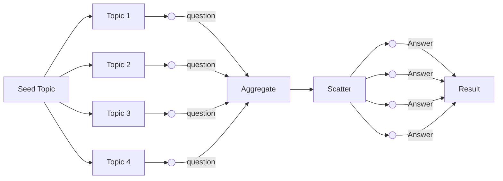
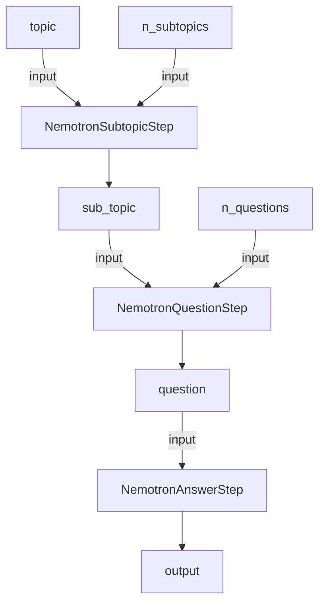

---
categories:
- Synthetic Data
description: Implement Nvidia's Preference Data Pipeline using Dria to generate synthetic
  data with Llama 3.1 for improved machine learning models.
tags:
- Nvidia
- Synthetic Data
- Dria
- Preference Data
- Machine Learning
---

# Implementing Nvidia's Preference Data Pipeline with Dria

In this cookbook, we'll implement the [`Synthetic Preference Data Generation Using Meta's Llama 3.1 405B Instruct`](https://github.com/NVIDIA/NeMo-Curator/blob/main/tutorials/synthetic-preference-data/synthetic_preference_data_generation_llama_3_1_405b.ipynb) data using Dria Network.

#### There are two steps in the Nvidia's example:

- *Synthetic Response Generation*: A domain specific input query will be provided by the developer - at which point Llama 3.1 405B Instruct will be leveraged to generate ~150 questions. Then, Llama 3.1 405B Instruct will be used to generated 2 responses for each question.
- *Reward Model as a Judge*: Nemotron-4 340B Reward will be used to score the 2 responses per question to be used for further alignment training via NeMo Aligner.


## Implementation 

Overall structure of the pipeline looks like this:



1. A seed `topic` is used to generate multiple `sub_topics`
2. Each `sub_topic` is fed into `question` generation step
3. The `questions` are then aggregated and scattered to `answer` generation step. 
4. The `answers` are then aggregated to produce the dataset.


### Setup

To start with implementation, we'll create a folder structure as follows:

```
- nemotron_qa
    - topics
        - __init__.py
        - task.py
        - prompt.md
    - questions
        - __init__.py
        - task.py
        - prompt.md
    - answers
        - __init__.py
        - task.py
        - prompt.md
    - __init__.py
    - pipeline.py

```

Each directory is for a specific step in the pipeline. The `task.py` in each directory will contain the implementation of the step whereas `prompt.md` will contain the prompt for the step.

### Prompts

From Nvidia's cookbook:

*Prompt for the first step: `NemotronSubtopicStep`*

```markdown
Given a topic, generate a list of {{n_subtopics}} subtopics that are related to the topic.
The topic is: {{topic}}
The list must be without numbers, and without any description of the subtopics. 
The subtopics should be separated by a comma. There must be no other text than the list.
```

*Prompt for the second step: `NemotronQuestionStep`*

```markdown
Given a topic, generate {{n_questions}} questions that could be asked about that topic. Your response should be in a list format.
The topic is: {{sub_topic}}
The list must be without numbers. 
The questions should be separated by a newline character. There must be no other text than the list.
```

*Prompt for the third step: `NemotronAnswerStep`*

```markdown
Given a question, generate 2 responses that could be given to that question. Your response should be in a list format.
The question is: {{question}}
The list must be in the format:
RESPONSE A: Response A text here
RESPONSE B: Response B text here
```

Variables `{{n_subtopics}}`, `{{topic}}`, `{{n_questions}}`, `{{sub_topic}}`, `{{question}}` will be replaced with the actual values during the execution of the pipeline.
Please note that variables are enclosed in double curly braces `{{}}`.


### Understanding the Flow of Data

It's important to note that prompts for each step has parameters that are passed from the previous step which creates a flow of data.
Inputs for a step are defined in the prompt and are passed from the previous step or explicitly set as user input.



Variables in prompts define expected input values for the step. The values are passed from the previous step to the next step.


### Implementing the Steps

Dria pipelines consists of Steps, which are instances of `StepTemplate`. 
We'll define a `StepTemplate` for each step in the pipeline. Each step must implement the `create_workflow` abstractmethod which returns a `Workflow` object.


#### Implementing the `NemotronSubtopicStep`

Let's first implement the `NemotronSubtopicStep` class. We'll use variables `topic` and `n_subtopics` in the prompt as input parameters for the step.

```python
class NemotronSubtopicStep(StepTemplate):
    def create_workflow(self, topic: str, n_subtopics: str) -> Workflow:
```

The `create_workflow` method will return a `Workflow` object. We'll use `WorkflowBuilder` to create the workflow.
The step will have a single `generative_step` in `Workflow` which will generate the subtopics.

```python
class NemotronSubtopicStep(StepTemplate):
    def create_workflow(self, topic: str, n_subtopics: str) -> Workflow:

        builder = WorkflowBuilder(topic=topic, n_subtopics=n_subtopics)
        builder.set_max_time(50)

        builder.generative_step(
            id="generate_subtopics",
            path=get_abs_path("prompt.md"),
            operator=Operator.GENERATION,
            outputs=[Write.new("subtopics")],
        )

        flow = [
            Edge(source="generate_subtopics", target="_end"),
        ]
        builder.flow(flow)
        builder.set_return_value("subtopics")

        return builder.build()
```

In order to determine how outputs of one step are passed as inputs to the next step, we'll define a `callback` method in the `NemotronSubtopicStep` class. The `callback` method will take the output of the step and return the input for the next step.
Since the output of the step is a list of subtopics, step returns a list of `TaskInput` objects for the next step. 

`NemotronSubtopicStep` is a `1->N` step, meaning it takes one input and produces multiple outputs. Therefore it's safe to use `step.output[0]` since we'll execute a single task to generate subtopics from a topic.

Creating a list of `TaskInput` objects for the next step results in executing **multiple tasks in parallel for the next step**. 

Note that since inputs for next step are `sub_topic` and `n_questions`, we'll create a `TaskInput` object for each subtopic generated in the previous step.

```python
    def callback(self, step: Step) -> List[TaskInput]:
        """
        1 -> N
        Args:
            step:

        Returns:

        """
        return [TaskInput(**{"sub_topic": topic, "n_questions": self.params.n_questions}) for topic in step.output[0].result.split(",")]

```

#### Implementing the `NemotronQuestionStep`

Implementation of `NemotronQuestionStep` and `NemotronAnswerStep` are similar.

```python
class NemotronQuestionStep(StepTemplate):
    def create_workflow(self, sub_topic: str, n_questions: str) -> Workflow:

        builder = WorkflowBuilder(sub_topic=sub_topic, n_questions=n_questions)
        builder.set_max_time(50)

        builder.generative_step(
            id="generate_questions",
            path=get_abs_path("prompt.md"),
            operator=Operator.GENERATION,
            outputs=[Write.new("questions")],
        )

        flow = [
            Edge(source="generate_questions", target="_end"),
        ]
        builder.flow(flow)
        builder.set_return_value("questions")

        return builder.build()
```

Callback for `NemotronQuestionStep` would be different since it's a `N->N`
Question step will receive multiple outputs and again distribute multiple inputs for the next step. 

In order to achieve this, callback method will loop through `step.output` values, parse them and create a List of `TaskInput` objects for the next step.
Because of how task is prompted, callback splits output by "," to obtain the list of questions generated by a single task.


```python
    def callback(self, step: Step) -> List[TaskInput]:
        """
        1 -> N
        Args:
            step:

        Returns:

        """
        questions = []
        for o in step.output:
            questions.extend(
                [
                    TaskInput(**{"question": q})
                    for q in o.result.split("\n")
                    if q.strip()
                ]
            )
        return questions
```

#### Implementing the `NemotronAnswerStep`

We follow a similar approach for `NemotronAnswerStep` as we did for `NemotronQuestionStep`.

```python
class NemotronAnswerStep(StepTemplate):
    def create_workflow(self, question: str) -> Workflow:

        builder = WorkflowBuilder(question=question)
        builder.set_max_time(50)

        builder.generative_step(
            id="generate_answers",
            path=get_abs_path("prompt.md"),
            operator=Operator.GENERATION,
            outputs=[Write.new("answers")],
        )

        flow = [
            Edge(source="generate_answers", target="_end"),
        ]
        builder.flow(flow)
        builder.set_return_value("answers")

        return builder.build()
```

Callback for `NemotronAnswerStep` would again be different since it's a `1->N` with different parameters.
Yet again caused by the prompt, we'll add parsing logic to the callback method to create a list of `TaskInput` objects as our output.

```python
    def callback(self, step: Step) -> List[TaskInput]:
        """
        1 -> N
        Args:
            step:

        Returns:

        """
        responses = []
        for o in step.output:
            resp = o.result
            question = o.task_input["question"]
            resp = resp.replace("RESPONSE A:", "").replace("RESPONSE B:", "")
            try:
                responses.append(
                    TaskInput(
                        **{
                            "question": question.strip(),
                            "response_a": resp.split("\n\n")[0].strip(),
                            "response_b": resp.split("\n\n")[1].strip(),
                        }
                    )
                )
            except:
                pass
        return responses
```

That's it! We've created all the steps.


#### Building the Pipeline

Final step for implementing the pipeline is to connect the steps using `PipelineBuilder`.
The `PipelineBuilder`requires a `Dria` instance and a `PipelineConfig` object. 

We'll create a `NemotronQA` class to build the pipeline.

```python
class NemotronQA:
    def __init__(self, dria: Dria):
        self.pipeline_config: PipelineConfig = PipelineConfig()
        self.pipeline = PipelineBuilder(self.pipeline_config, dria)
```

Since we have implemented three steps, we'll define a list of models for each step. 

See [models](../../how-to/models) for the full list of available models. 

We define a list of models which act as a `model pool` for the step. If there are 100 tasks within that step, available nodes that runs one of the models will execute the task asynchronously.

```python
class NemotronQA:
    def __init__(self, dria: Dria):
        self.pipeline_config: PipelineConfig = PipelineConfig()
        self.pipeline = PipelineBuilder(self.pipeline_config, dria)
        self.models_list = [
            [Model.GPT4O],
            [
                Model.GPT4O_MINI,
                Model.QWEN2_5_32B_FP16,
                Model.GEMINI_15_FLASH,
                Model.MIXTRAL_8_7B,
                Model.QWEN2_5_7B_FP16,
            ],
            [
                Model.O1_MINI,
                Model.LLAMA3_1_8B_FP16,
                Model.GPT4O,
            ],
        ]
```

We'll define a `build` method which will connect the steps to the pipeline. 

External parameters for this pipeline (i.e the ones that are not generated) are pipelines set as the input parameters of `NemotronQA` pipeline.

Even though Pipeline has three external params, first step only requires `topic` and `n_subtopics` as input.

See the flow of data [section](#understanding-the-flow-of-data)

That's why we are setting our pipeline input as `(topic=topic, n_subtopics=n_subtopics` and feeding n_questions as a parameter to the first step.

`NemotronSubtopicStep` inputs this parameter to second step. See [subtopic callback](#implementing-the-nemotronsubtopicstep).

```python
    def build(self, topic: str, n_subtopics: str, n_questions: str) -> Pipeline:

        self.pipeline.input(topic=topic, n_subtopics=n_subtopics)
        (
            self.pipeline
            << NemotronSubtopicStep(n_questions=n_questions)
            .set_models(self.models_list[0])
            .custom()
        )
        self.pipeline << NemotronQuestionStep().set_models(self.models_list[1]).custom()
        self.pipeline << NemotronAnswerStep().set_models(self.models_list[2]).custom()

        return self.pipeline.build()
```

Dria connects Steps to the pipeline using `<<` notation. The order of the steps determines the order of execution.

Phew, that's it! We've implemented the pipeline.

## Running the Pipeline

Running the pipeline is pretty straight forward.

```python
import os
from dria.client import Dria
import asyncio
import json
from dria.factory import NemotronQA

dria = Dria(rpc_token=os.environ["DRIA_RPC_TOKEN"])


async def run_pipeline():

    await dria.initialize()
    pipeline = NemotronQA(dria).build(
        topic="Machine Learning", n_subtopics="10", n_questions="5"
    )

    result = await pipeline.execute(return_output=True)
    with open("output.json", "w") as f:
        json.dump(result, f, indent=4)


if __name__ == "__main__":
    asyncio.run(run_pipeline())

```

## Code

Access the full code [here](https://github.com/firstbatchxyz/dria-sdk/tree/master/examples/nvidias_preference_data_pipeline).