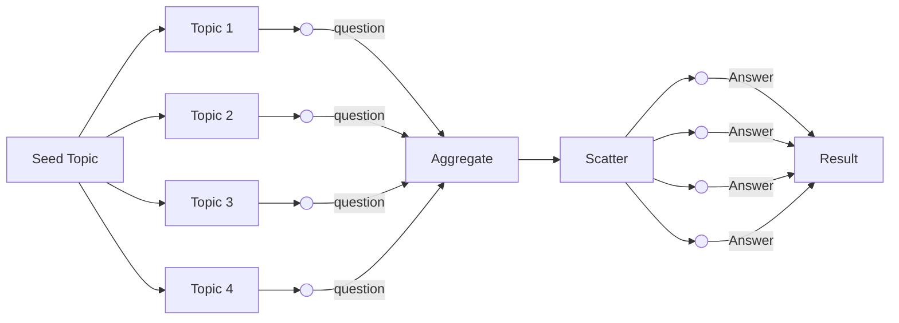

---
categories:
- Workflows
description: Learn to create efficient pipelines using asynchronous processing to
  generate complex outputs from multiple workflows.
tags:
- Pipelines
- Workflows
- Asynchronous Processing
- Data Generation
- QA Pairs
---

# Creating Pipelines

Pipelines are used to generate complex outputs by combining multiple [workflows](workflows.md). 
Key feature is to utilize asynchronous processing to execute multiple workflows in parallel and connect them in a sequence.

#### Understanding Pipelines

Pipelines are a sequence of workflows that are executed in a specific order.
Each workflow can have multiple steps, and the output of one step can be used as input for the next step.
Let's think of a Question Answer pipeline where the first step is to generate a question and the second step is to find the answer to the question.

Normally in a synchronous environment, the output of the first step is used as input for the second step. 
*But what if we need to create 100 questions and find their answers?* 

We need Dria network to execute each instruction in parallel yet to create answers, we need the questions.

#### Example Flow: Generating QA Pairs from Topics

Nvidia's [Synthetic Preference Data Generation Using Meta's Llama 3.1 405B Instruct](https://github.com/NVIDIA/NeMo-Curator/blob/main/tutorials/synthetic-preference-data/synthetic_preference_data_generation_llama_3_1_405b.ipynb) is a good example of a pipeline that generates QA pairs from topics.
In layman's terms:
1. Generate topics from seed topics.
2. Generate questions from topics.
3. Generate answers from questions.

An overview of the pipeline is as follows:



Check our [cookbook](../cookbook/preference_data.md) for implementing the `Synthetic Preference Data Generation Using Meta's Llama 3.1 405B Instruct` with Dria.

---
#### Implementing Pipelines


The `Pipeline` class is used to define the list of workflows, their corresponding models and the input data.

A pipeline consists of Steps, which are instances of `StepTemplate`.

Let's define a two-step pipeline by implementing `FirstPipelineStep` and `SecondPipelineStep`.
Steps must implement the `create_workflow` abstractmethod which returns a `Workflow` object.

```python
from dria_workflows import *
from dria.pipelines import StepTemplate

class FirstPipelineStep(StepTemplate):
    def create_workflow(self, instruction: str) -> Workflow:
        pass
```

##### Implementing the first step

For clarification, let's implement the `FirstPipelineStep` class to create variations for an instruction.

```python
from dria_workflows import *
from dria.pipelines import StepTemplate


class FirstPipelineStep(StepTemplate):
    def create_workflow(self, instruction: str) -> Workflow:
        
        # Create a workflow builder
        builder = WorkflowBuilder(instruction=instruction)

        # Add a step to your workflow
        builder.generative_step(
            id="generate_variations",
            prompt="Rewrite 5 variations of given instruction by making small changes. Instruction: {{instruction}}. Output a single Python list for new instructions, and nothing else. New instructions:",
            operator=Operator.GENERATION,
            outputs=[Write.new("variations")],
        )

        # Define flow
        flow = [Edge(source="generate_variations", target="_end")]
        
        # Build workflow
        builder.flow(flow)
        builder.set_return_value("variations")
        workflow = builder.build()
        return workflow
```

`FirstPipelineStep` generates 5 variations of the given instruction. 

Instruction: 

> `Write a haiku`

Output:
```json
[
   "write a Japanese-style haiku",
   "compose a three-line poem",
   "craft a traditional tanka",
   "create a nature-inspired haiku",
   "draft a short, 5-7-5 syllable poem"
]
```

##### Implementing the second step

For the second step, `SecondPipelineStep`, we will use the output of the first step as input. 
Second step will execute each instruction and return the output.


```python
class SecondPipelineStep(StepTemplate):
    def create_workflow(self, instruction: str) -> Workflow:

        builder = WorkflowBuilder(instruction=instruction)

        builder.generative_step(
            id="execute_instruction",
            path="{{instruction}}",
            operator=Operator.GENERATION,
            outputs=[Write.new("output")],
        )

        flow = [Edge(source="execute_instruction", target="_end")]
        builder.flow(flow)
        builder.set_return_value("output")
        workflow = builder.build()
        return workflow
```

Created steps are connected to a pipeline through `PipelineBuilder`. 
`BasicPipeline` has two steps: `FirstPipelineStep` and `SecondPipelineStep` which are instances of `StepTemplate`. 

We use `<<` notation to add multiple steps to the pipeline and determine the order of execution. 


```python
from dria.client import Dria
from dria.pipelines import Pipeline, PipelineConfig, PipelineBuilder
class BasicPipeline:

    def __init__(self, dria: Dria, config: PipelineConfig):
        self.pipeline_config: PipelineConfig = config or PipelineConfig()
        self.pipeline = PipelineBuilder(self.pipeline_config, dria)

    def build(self, instruction: str) -> Pipeline:
        
        self.pipeline.input(instruction=instruction)
        self.pipeline << FirstPipelineStep().scatter() << SecondPipelineStep()
        return self.pipeline.build()
```


Instead looping through variations generated in the first step, and executing them one-by-one, we use special `scatter` callback to execute them in parallel.
Pipeline will automatically handle the parallel execution of the steps by parsing the json output and sending each instruction as a seperate task to network.
In order to achieve this, `FirstPipelineStep` must output a valid JSON deserializable list. 

Finally we set the input instruction using the `input` method. and build the pipeline 

#### Callbacks

Callbacks are executed after a step is finished. Dria provides three built-in callbacks:

1. `scatter`: 1-N mapping of input to output. Used to execute multiple tasks in parallel. Suitable when a step output is a list.
2. `broadcast`: 1-N mapping of input to output. Used to duplicate the input to multiple tasks. Suitable when a step output is a single value.
3. `aggregate`: N-1 mapping of input to output. Used to combine multiple outputs into a single output. Suitable when a step output is a list.

```python
self.pipeline << FirstPipelineStep().scatter() << SecondPipelineStep()
```

*Custom Callbacks*: You can define custom callbacks by implementing the `callback` method for `StepTemplate` class. 

Custom callback takes a `Step` object as input and returns a `TaskInput` or  `List[TaskInput]`. Custom callbacks enable design of custom input-output matching between steps of the pipeline.
Here is an example of a custom callback:

```python
def callback(self, step: "Step") -> Union[List[TaskInput], TaskInput]:
    """
    Only to use as the last callback
    Args:
        step:

    Returns:

    """
    # flatten list of lists
    outputs = [parse_json(o.result) for o in step.output]
    flattened = [item for sublist in outputs for item in sublist]
    return TaskInput(**{"subtopics": flattened})
```

Callback above flattens the list of lists and returns a single `TaskInput` object.
An important point to note is that custom callbacks keys should match the keys of the input of the next step in the pipeline.
For our case, the next step should have a key `subtopics` in its input.