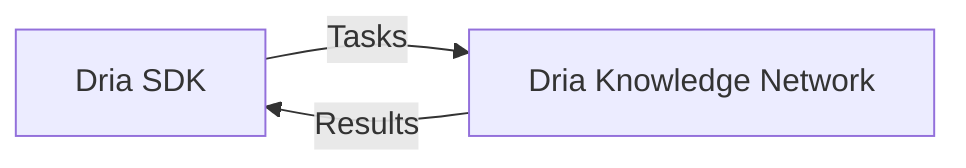

---
categories:
- Workflows
description: Explore tasks in the Dria network, focusing on execution, model selection,
  and asynchronous workflows for efficient processing.
tags:
- Dria Network
- Asynchronous Execution
- Task Management
- Model Selection
- P2P Computing
---

# Tasks

Tasks are a fundamental concept in the Dria network. 
They represent units of work that are executed by nodes in the network. 
Understanding how tasks work is crucial for effectively using the Dria system.

### What is a Task?

A task in Dria consists of a [workflow](workflows.md) and a set of [models](models.md).

Tasks are executed asynchronously by nodes in the Dria network. When you create a task, you're essentially publishing it to the network for execution.



Nodes in the network listens to P2P messages and execute tasks based on their capabilities and availability. 
We can think each [compute-node](https://github.com/firstbatchxyz/dkn-compute-node) as processor in [LLM OS](https://x.com/karpathy/status/1723140519554105733).
They have memory, tools, and a model to execute tasks.


**Key Features of Tasks**

1. **Model Selection**: You can specify which models you want to assign your task to. This allows for flexibility in choosing the most appropriate model for your specific needs.

2. **Asynchronous Execution**: Tasks are published to the network and executed by available nodes. This asynchronous nature allows for efficient distribution of work across the network.

3. **Result Retrieval**: After a task is executed, results are published back to the network.

4. **Scalability**: There is no limit to the number of tasks you can publish to the network, allowing for highly scalable operations.

### Sending Tasks

In this example, we are using `Simple` task, one of the built-in tasks that takes prompt and executes it on a model.
See [Singletons](singletons.md) for more details.

```python
import os
import asyncio
from dria.factory import Simple
from dria.client import Dria
from dria.models import Task, Model

dria = Dria(rpc_token=os.environ["DRIA_RPC_TOKEN"])

async def evaluate():
    simple = Simple()
    res = await dria.execute(
        Task(
            workflow=simple.workflow(prompt="Hey there!"),
            models=[Model.GPT4O],
        )
    )
    return simple.parse_result(res)


if __name__ == "__main__":
    asyncio.run(evaluate())
```

### Lifecycle of a Task

- Task Creation: You create a task by specifying a workflow and models.
- Task Publication: The task is published to the network for execution.
- Task Execution: Nodes that run one of the selected models execute the task asynchronously.
- Result Retrieval: After execution, the result is published back to the network.
- Result Polling: SDK polls the network to retrieve the result.
- Task Completion: The task is marked as completed once the result is retrieved.